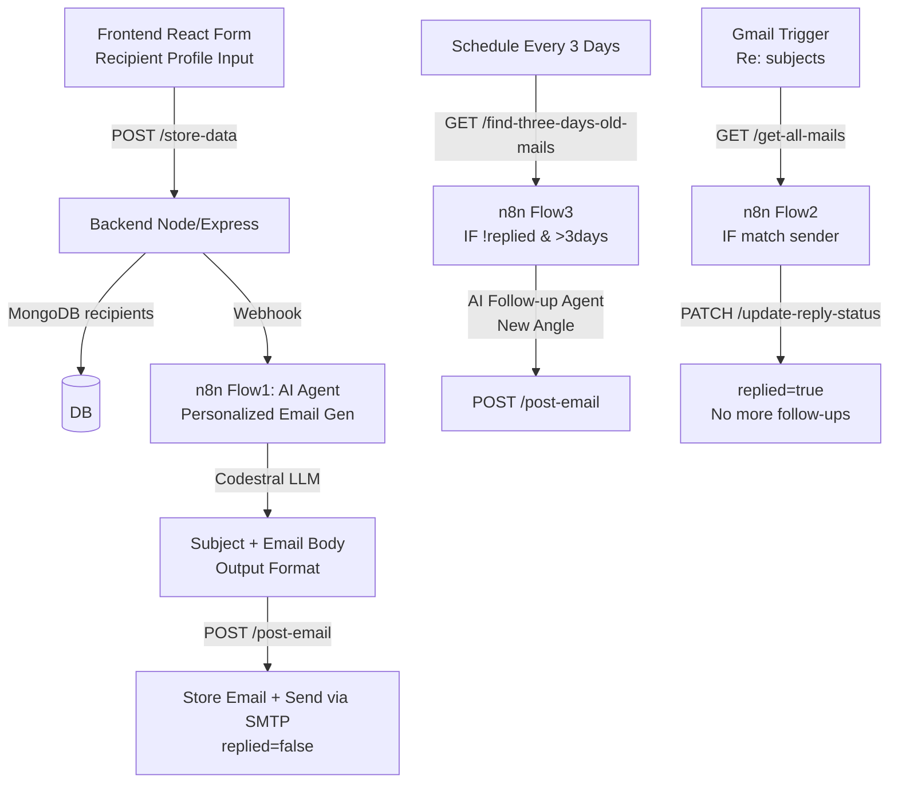

# Cold Outreach Agent with Prompt Optimization

[](https://nodejs.org)
[](https://reactjs.org)
[](https://n8n.io)
[](https://mongodb.com)
[](https://mistral.ai)

**Objective**: AI-powered agent that generates **personalized cold outreach emails** using recipient profiles, implements **feedback loops** (no-reply → follow-up after 3 days), and **reply detection** to optimize future outreach. Uses conversation history/context for prompt evolution.

**Reference Stack Implemented**:

- ✅ **AI Copywriter**: Mistral Codestral for token-efficient personalization
- ✅ **Memory**: MongoDB (recipients profiles + email history with reply status)
- ✅ **Workflow**: n8n for sequencing (initial → follow-up → reply handling)
- ✅ **Email**: Gmail SMTP via Nodemailer
- ✅ **Bonus Channels**: LinkedIn/Twitter APIs (future)

**Success Criteria**:

- ✅ Personalized messages using profile (name/role/company/pain/goal)
- ✅ Feedback: 3-day no-reply → angle-B follow-up
- ✅ Cost-aware: Single efficient model (Codestral)
- ✅ README explains prompt evolution (initial vs follow-up angles)

## Architecture



## Quick Start

### 1. Prerequisites

- Node.js 18+
- MongoDB Atlas/Compass (free tier)
- n8n instance (self-hosted/cloud)
- Gmail app password for SMTP
- Mistral Cloud API key

### 2. Environment (.env in Backend/)

```
MONGODB_URI=your-mongodb-atlas-uri
EMAIL_USER=your@gmail.com
EMAIL_PASS=your-gmail-app-password
N8N_BASE_URL=http://your-n8n:5678/webhook/
```

### 3. Backend

```bash
cd Backend
npm install
node index.js
# http://localhost:3000
```

### 4. Frontend

```bash
cd Frontend
npm install
npm run dev
# http://localhost:5173
```

### 5. n8n

- Import `Cold outreach agent automation.json`
- Credentials: Mistral Cloud, Gmail OAuth2
- Activate flows

## Features

1. **Personalized Initial Email** (<120 words):
   - Profile-driven (pain/goal/role/company)
   - Angles: Pain-solution
   - Human tone + soft CTA

2. **Intelligent Follow-ups** (<90 words, after 3 days no-reply):
   - Switches angles (e.g., pain → curiosity)
   - Polite check-in, no repetition

3. **Auto Reply Detection**:
   - Gmail triggers on Re: subjects
   - Updates DB → prevents further emails

## API Endpoints (Backend)

| Endpoint                     | Method | Desc                       |
| ---------------------------- | ------ | -------------------------- |
| `/store-data`                | POST   | Save profile + trigger n8n |
| `/post-email`                | POST   | Store & send AI email      |
| `/get-all-mails`             | GET    | List emails                |
| `/find-three-days-old-mails` | GET    | Unreplied >3 days          |
| `/update-mail-reply-status`  | PATCH  | Mark replied               |

## AI Prompts (Mistral Codestral)

**Initial**:

```
Personalize using profile. ONE angle. <120 words.
Subject: ...Email:...
```

**Follow-up**:

```
New angle. Reference prior lightly. <90 words.
Gentle bump or soft breakup.
```

## Future

- Multi-channel (LinkedIn)
- LLM chain for strategy → copy
- Analytics dashboard

**Test Flow**: Form → AI email → 3 days → follow-up → reply → stop.
